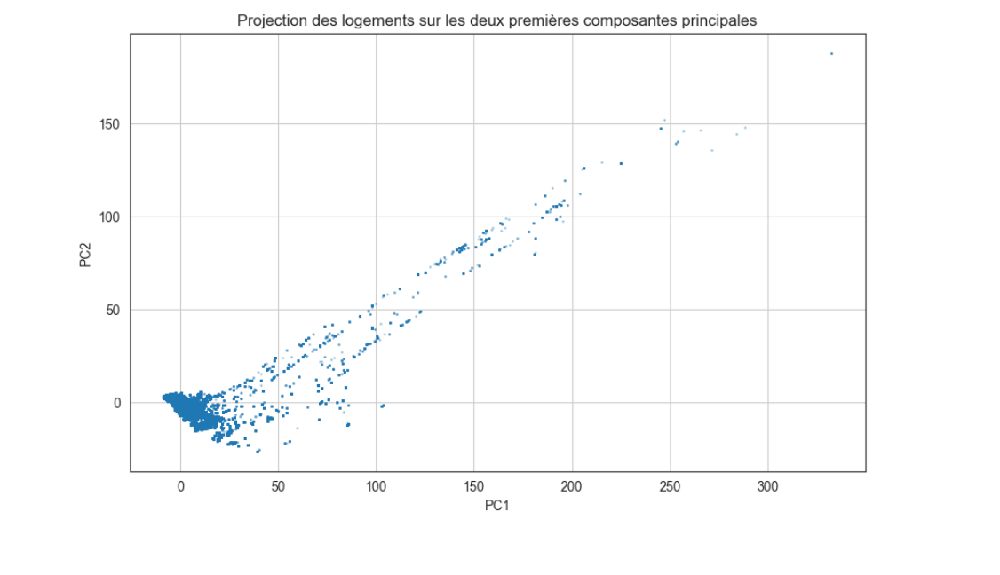
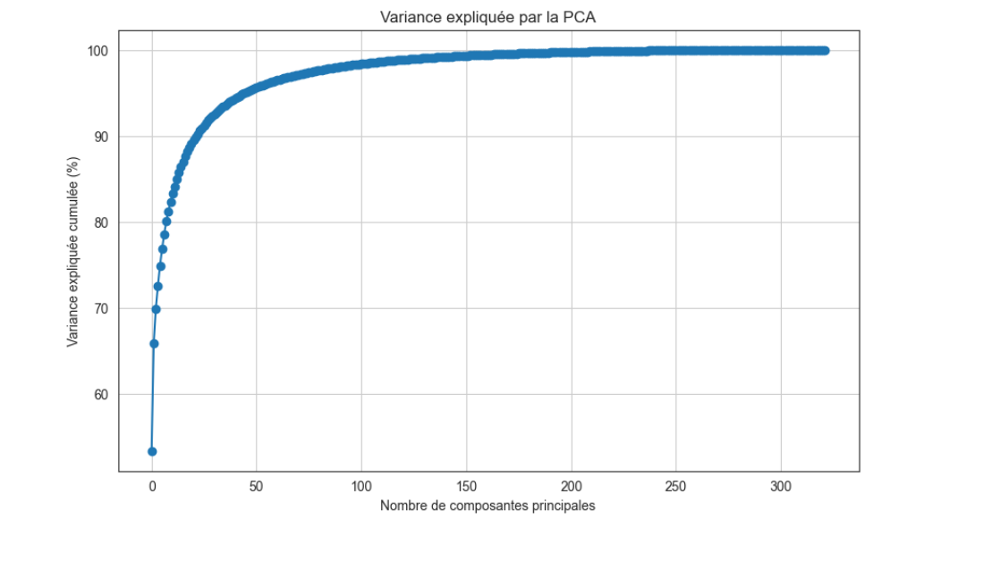

## 🖼️ Visual Highlights

Here are some key visualizations from the PCA-based housing price analysis in Shanghai:

### 🗺️ 1. Housing data spatial distribution
A map showing the geographic distribution of housing listings across Shanghai. Each dot represents a property used in the analysis.

---

### 📊 2. PCA Projection (PC1 vs PC2)
A projection of housing listings on the first two principal components. This helps reduce dimensionality and visualize structure in the dataset.

---

### 📈 3. Cumulative Explained Variance
This curve shows how much of the total variance in the dataset is explained by the number of principal components retained. We see a rapid saturation, justifying dimensionality reduction.

